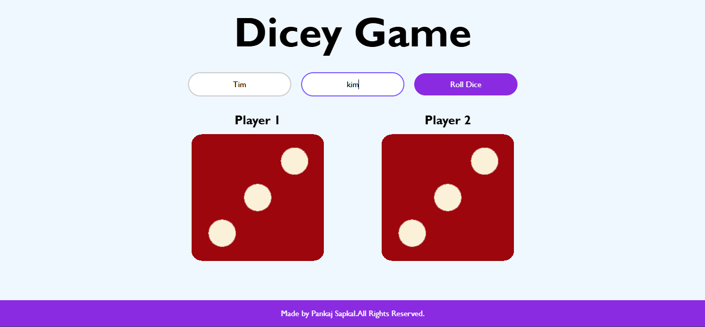
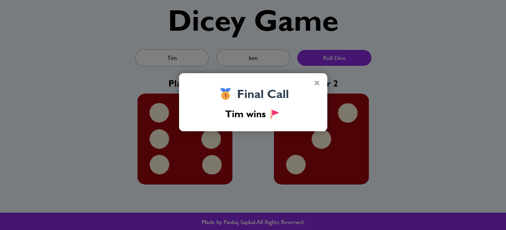

# Dicey Game 🎲

A fun two-player **Dice Rolling Game** built with **HTML, CSS, and JavaScript**.

This interactive web game lets two players roll dice with sound effects, animations, and a winner popup. 
It’s a great portfolio project showcasing DOM manipulation, event handling, and front-end development.

## Features
- Enter custom player names
- Roll animated dice with sound effects
- Display winner in a styled modal popup
- Responsive and interactive UI

### Gameplay Screenshots
  

## How to Play
1. Open `index.html` in your browser.
2. Enter player names (optional).
3. Click **Roll Dice**.
4. Watch the dice roll animation and see who wins!

## Play Online
[Click here to play the Dicey Game](https://pankaj4532.github.io/Dicey-Game-A-Fun-Two-Player-Dice-Rolling-Game/) 

## Project Structure
- `index.html` - Main game page
- `styles.css` - Styles for the game
- `index.js` - Game logic and dice roll functionality
- `images/` - Dice images (1–6)
- `sounds/` - Dice roll sound effect

## Author
Made by **Pankaj Sapkal**.

---
Feel free to use or improve this project for your portfolio!
